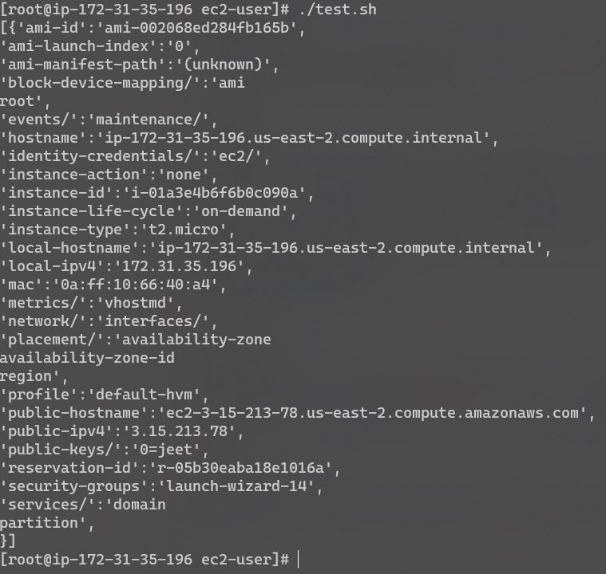

**Challenge #1**

A 3-tier environment is a common setup. Use a tool of your choosing/familiarity create these resources. Please remember we will not be judged on the outcome but more focusing on the approach, style and reproducibility.

**Solution:**

For 3-tier environment/architecture we are using Terraform which is Infrastructure as Code (IaC) 
IaC allows us to provision and configure our environments in a reliable and safe way.

This repository contains code for a 3 tier architecture. It uses terraform to create Infra over AWS cloud and deploys a basic apache server.
The repo has two file main.tf and install_apache.sh to install apache server on the instances and create a unique landing page for each so that we can verify the ALB is working.

**3-tier Architecture Diagram**

**Challenge #2**

We need to write code that will query the meta data of an instance within AWS and provide a json formatted output. The choice of language and implementation is up to you.
Bonus Points
The code allows for a particular data key to be retrieved individually

**Solution:**

The Shell Script will query the meta data of an linux instance within AWS and provide a JSON formatted output.

Note:- Give the required executable permission to the shell script metadata.sh before executing. 

Output:

